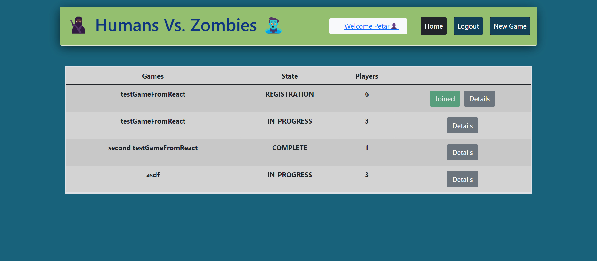
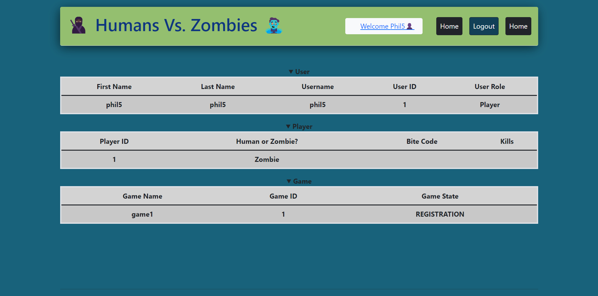
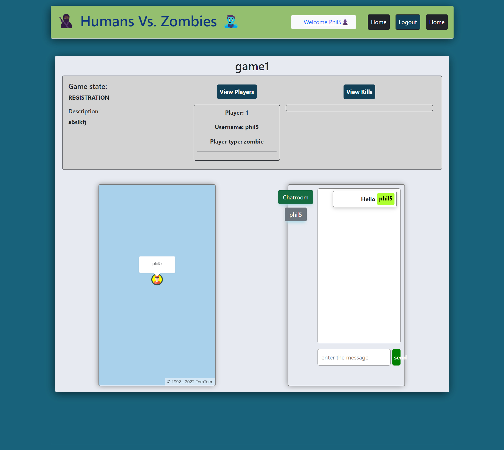
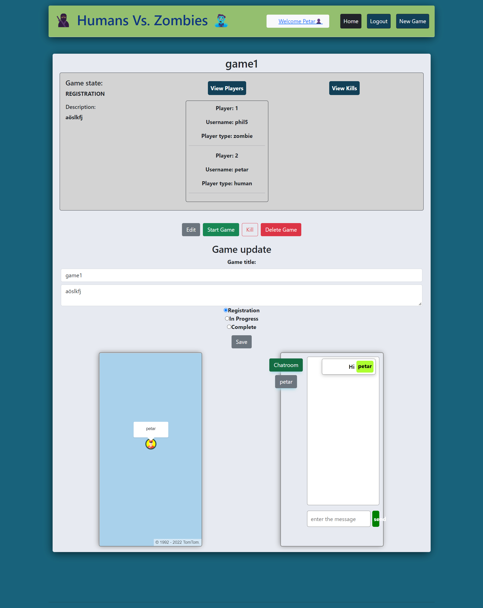

# Case Period: Humans vs. Zombies

This application implements a management application for the game humans vs. Zombies


## Storage
The application data are stored in a postgres database. 

## Frontend 

The Frontend is implemented in react and enables users to manage all the game information.
It stores and fetches all the data in the postgres database using the REST API in the backend.
You can find the code <a href="https://gitlab.com/gitlab-experis-petar_phil/hvz-game-ginal_case_frontend">here</a>.
The application is deployed <a href="">here //Todo insert Link</a>.
Here you can see how the user interface looks:

<details>
  <summary>home page</summary>
  
</details>
<details>
  <summary>profile page</summary>
  
</details>
<details>
  <summary>new game</summary>
  
</details>
<details>
  <summary>game details as player</summary>
  
</details>
<details>
  <summary>game details as admin</summary>
  
</details>

## Backend
## Security

## Usage

The application is deployed at: https://obscure-woodland-51059.herokuapp.com/

If you want to run it yourself, you simpy need to clone the repo and run</br> ```npm install; npm run start```


## Maintainer

[Petar Dimitrov]

[Philipp Loibl]

[Igor Figueiredo]

[Mohammed El Maghawry]

## License

[MIT]
---

[Petar Dimitrov]: https://github.com/PetarDimitrov91

[Philipp Loibl]: https://github.com/Loibl33

[Igor Figueiredo]: https://gitlab.com/Igor-GF

[Mohammed El Maghawry]: https://gitlab.com/El-Maghawry

[MIT]: https://choosealicense.com/licenses/mit/


