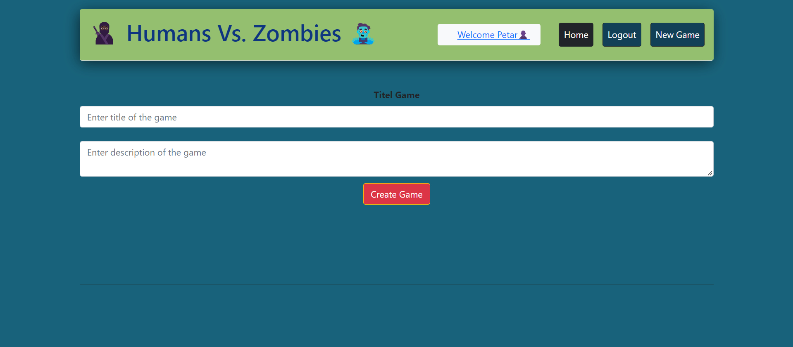

# Case Period: Humans vs. Zombies

This application implements a management application for the game humans vs. Zombies


## Storage
The application data are stored in a postgres database. 

## Frontend 

The Frontend is implemented in react and enables users to manage all the game information.
It stores and fetches all the data in the postgres database using the REST API in the backend.
You can find the code <a href="https://gitlab.com/gitlab-experis-petar_phil/hvz-game-ginal_case_frontend">here</a>.
The application is deployed <a href="">here //Todo insert Link</a>.
Here you can see how the user interface looks:

<details>
  <summary>home page</summary>
  
</details>
<details>
  <summary>profile page</summary>
  
</details>
<details>
  <summary>new game</summary>
  
</details>
<details>
  <summary>game details as player</summary>
  
</details>
<details>
  <summary>game details as admin</summary>
  
</details>

## Backend

The backend is implemented using spring and provides a REST API for the data stored in the postgres database.
It is deployed <a href=""> here //todo insert link</a>.
You can find the code on <a href="">gitlab //todo insert link</a>.
You can also have a look at the endpoints <a href="public/documents/endpoints.pdf" type=file>here</a>.


## Security
To protect the backend from unauthorized access keycloak is used.
It is deployed <a href=""> here //todo insert link</a>

## Usage

To access the application you can simply use the <a href="">frontend link//todo insert link</a>. 
If you want to run it locally you can clone the backend and the frontend repo and run ```docker compose up -d``` in the project root directories.


## Maintainer

[Petar Dimitrov]

[Philipp Loibl]

[Igor Figueiredo]

[Mohammed El Maghawry]

## License

[MIT]
---

[Petar Dimitrov]: https://github.com/PetarDimitrov91

[Philipp Loibl]: https://github.com/Loibl33

[Igor Figueiredo]: https://gitlab.com/Igor-GF

[Mohammed El Maghawry]: https://gitlab.com/El-Maghawry

[MIT]: https://choosealicense.com/licenses/mit/


